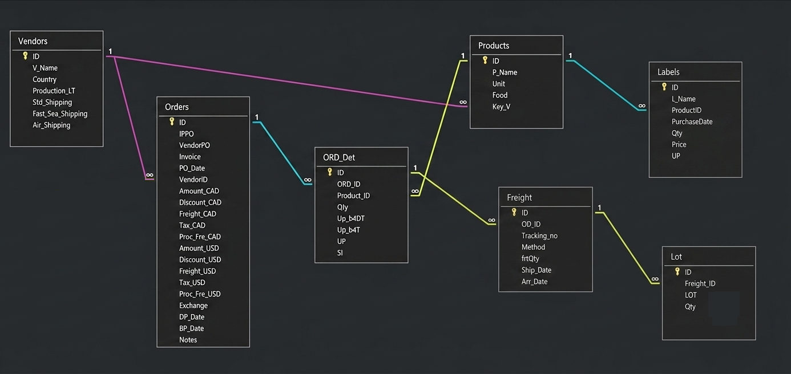

# ProcurementDB: Supply Chain Purchasing, Freight Tracking & Lot Tracing Database

---

Note: This public version preserves the database design and query logic while removing all original business data and sensitive information for privacy protection.

---

## Project Overview

This database was designed to centralize procurement data and improve visibility across the entire procurement lifecycle.

Instead of managing purchase orders, supplier information, freight records, lot numbers, and cost calculations in separate spreadsheets, this relational database consolidates them into a single normalized system. It supports purchasing activities from supplier selection through freight arrival while maintaining product-level cost history and lot traceability.

The database establishes a single source of truth for procurement activities by connecting purchasing, logistics, lot traceability, and warehouse records into one relational model.

Rather than functioning only as a purchasing record, the database also serves as a decision-support tool through operational reports for supplier price reviews, lot tracking, inventory auditing, and purchasing planning.

More importantly, this project demonstrates my ability to transform fragmented procurement information into a structured data model that improves traceability, data consistency, and day-to-day supply chain operations.

---

## Core Business Capabilities

### **Procurement Cost Management**

Maintains complete purchasing records, including supplier quotations, purchase orders, landed costs, taxes, freight charges, and historical pricing. This provides a centralized view of procurement costs for future purchasing decisions.

### **Lot Traceability**

Tracks products from purchase orders through freight arrivals to individual lot numbers, making it possible to trace inventory batches and monitor remaining quantities after warehouse distribution.

### **Supplier Planning Support**

Stores supplier lead times and available shipping methods, providing a historical reference for procurement planning and supplier evaluation.

### **Vendor Asset Management**

Tracks prepaid packaging labels stored at suppliers and compares purchased quantities with actual usage, helping monitor remaining inventory and reduce unnecessary reorders.

---

## Database Relationship Diagram
Below is the optimized entity-relationship schema designed for high-performance querying and cross-functional visibility:

---

## Data Dictionary & Schema

The database consists of the following key tables:

### 1. `Vendors`
Stores supplier information and shipping lead times.

* **`ID`** (AutoNumber / PK): Unique vendor identifier.
* **`V_Name`** (Short Text): Vendor name.
* **`Country`** (Short Text): Vendor location.
* **`Production_LT`** (Number): Standard production lead time.
* **`Std_Shipping`** (Number): Standard sea shipping lead time.
* **`Fast_Sea_Shipping`** (Number): Expedited sea shipping lead time.
* **`Air_Shipping`** (Number): Air freight lead time.

---

### 2. `Products`

Stores master information for purchased products.

* **`ID`** (AutoNumber / PK): Unique product identifier.
* **`P_Name`** (Short Text): Product name.
* **`Unit`** (Number): Units per case.
* **`Food`** (Short Text): Indicates whether the product is food.
* **`Key_V`** (Number): Primary supplier of the product.

---

### 3. `Orders`

Stores purchase order information and order-level financial records.

* **`ID`** (AutoNumber / PK): Unique purchase order identifier.
* **`IPPO`** (Short Text): Internal purchase order number.
* **`VendorPO`** (Short Text): Supplier purchase order number.
* **`Invoice`** (Short Text): Supplier invoice number.
* **`PO_Date`** (Date/Time): Purchase order date.
* **`VendorID`** (Number / FK): Links to the supplier.
* **`Amount_CAD`** (Number): Total order amount in CAD.
* **`Discount_CAD`** (Number): Total discount applied.
* **`Freight_CAD`** (Number): Freight cost.
* **`Tax_CAD`** (Number): Tax amount.
* **`Proc_fee_CAD`** (Number): Processing fee.
* **`Amount_USD`** (Number): Total order amount in USD.
* **`Discount_USD`** (Number): Discount in USD.
* **`Freight_USD`** (Number): Freight cost in USD.
* **`Tax_USD`** (Number): Tax amount in USD.
* **`Proc_fee_USD`** (Number): Processing fee in USD.
* **`Exchange`** (Number): Exchange rate.
* **`DP_Date`** (Date/Time): Deposit payment date.
* **`BP_Date`** (Date/Time): Balance payment date.
* **`Notes`** (Long Text): Additional purchasing notes.

---

### 4. `ORD_Det`

Stores line-item details for each purchase order.

* **`ID`** (AutoNumber / PK): Unique line item identifier.
* **`ORD_ID`** (Number / FK): Purchase order reference.
* **`Product_ID`** (Number / FK): Purchased product.
* **`Qty`** (Number): Quantity ordered.
* **`UP_b4DT`** (Number): Unit price before discount and tax.
* **`UP_b4T`** (Number): Unit price after discount but before tax.
* **`UP`** (Number): Final unit price including discount and tax.
* **`SI`** (Short Text): Indicates whether shipping is included in the unit price.

---

### 5. `Freight`

Stores shipment information for each purchase order line.

* **`ID`** (AutoNumber / PK): Unique shipment identifier.
* **`OD_ID`** (Number / FK): Purchase order line reference.
* **`Tracking_no`** (Short Text): Shipment tracking number.
* **`Method`** (Short Text): Shipping method.
* **`frtQty`** (Number): Quantity shipped.
* **`Ship_Date`** (Date/Time): Shipment departure date.
* **`Arr_Date`** (Date/Time): Shipment arrival date.

---

### 6. `Lot`

Stores lot or batch information for received inventory.

* **`ID`** (AutoNumber / PK): Unique record identifier.
* **`Freight_ID`** (Number / FK): Shipment reference.
* **`LOT`** (Short Text): Lot or batch number.
* **`Qty`** (Number): Quantity received for the lot.

---

### 7. `POTracking`

Tracks inventory movements after products arrive at the warehouse.

* **`ID`** (AutoNumber / PK): Unique tracking record.
* **`Reason`** (Short Text): Reason for inventory movement.
* **`Description`** (Short Text): Product name.
* **`Quantity`** (Number): Quantity moved.
* **`LOT`** (Short Text): Related lot number.
* **`Expiration`** (Date/Time): Product expiration date.
* **`Receiving`** (Date/Time): Original inventory receipt date.
* **`PickUP`** (Date/Time): Warehouse pickup date.
* **`Warehouse`** (Short Text): Warehouse name.

---

### 8. `Labels`

Tracks prepaid product labels stored at suppliers.

* **`ID`** (AutoNumber / PK): Unique label record.
* **`L_Name`** (Short Text): Label name.
* **`ProductID`** (Number / FK): Associated product.
* **`PurchaseDate`** (Date/Time): Purchase date.
* **`Qty`** (Number): Quantity purchased.
* **`Price`** (Number): Total purchase cost.
* **`UP`** (Number): Unit price.

---

## SQL Reports

The SQL queries in this project automate recurring procurement analyses and provide operational reports used during purchasing and inventory reviews.

### `Recent_Order_Price.sql`

Retrieves the most recent purchase price for each product, allowing buyers to quickly review current pricing before placing new orders.

**Output**

One row per **Product**.

| Column | Description |
|---------|-------------|
| P_Name | Product name |
| PO_Date | Most recent purchase order date |
| UP_b4T | Latest unit price before tax |
| UP | Latest unit price after tax |
| SI | Shipping inclusion indicator |
| Unit | Number of units per case |
| CasePrice | Calculated case price based on the latest unit cost |

### `Last_Six_Months_Price.sql`

Displays historical purchase prices over the previous six months, making it easier to identify price changes and support supplier negotiations.

**Output**

One row per **Purchase Order Line** within the last six months.

| Column | Description |
|---------|-------------|
| P_Name | Product name |
| PO_Date | Purchase order date |
| UP_b4T | Unit price before tax |
| UP | Unit price after tax |
| SI | Shipping inclusion indicator |

### `Lot_Numbers_List.sql`

Lists all received lot numbers together with their arrival dates, providing a quick reference for product traceability.

**Output**

One row per **Lot Number**.

| Column | Description |
|---------|-------------|
| P_Name | Product name |
| LOT | Lot (batch) number |
| Qty | Quantity received for the lot |
| Arr_Date | Freight arrival date |

### `Remaining_Labels.sql`

Compares purchased label quantities with actual usage to estimate remaining inventory held by suppliers.

**Output**

One row per **Label–Product** combination.

| Column | Description |
|---------|-------------|
| L_Name | Label name |
| P_Name | Product associated with the label |
| Remaining Qty | Estimated remaining prepaid labels after deducting historical usage |

### `Order_Lot_Tracker.sql`

Connects purchase orders, freight records, lot numbers, and warehouse transactions into a single report, providing complete traceability for each inventory batch.

**Output**

One row per **Lot Movement Record**.

| Column | Description |
|---------|-------------|
| P_Name | Product name |
| PO_Date | Purchase order date |
| LOT | Lot (batch) number |
| Description | Warehouse transaction description |
| Quantity | Quantity moved |
| Reason | Movement reason (shipment, adjustment, etc.) |
| Expiration | Product expiration date |
| Receiving | Warehouse receiving date |
| PickUP | Warehouse pickup date |
| Warehouse | Warehouse location |

### `Lot_Tracking.sql`

Calculates the remaining quantity for each lot by comparing inbound receipts with outbound warehouse records.

**Output**

One row per **Lot Number**.

| Column | Description |
|---------|-------------|
| P_Name | Product name |
| LOT | Lot (batch) number |
| TotalQty | Total quantity received for the lot |
| OutboundQty | Total quantity shipped from the lot |
| InStock | Remaining inventory balance for the lot |
